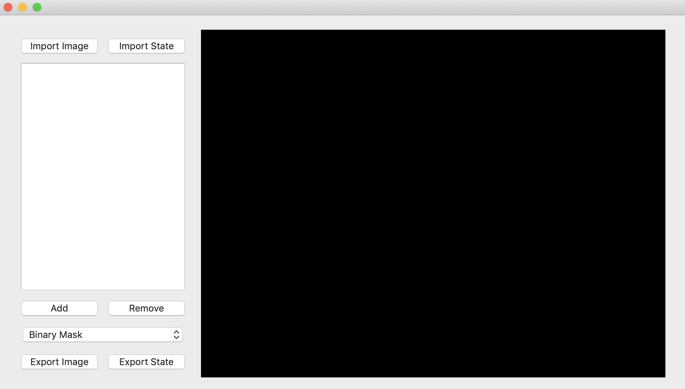
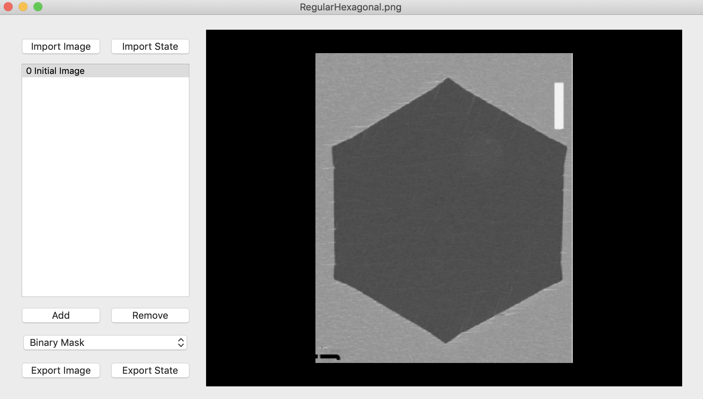
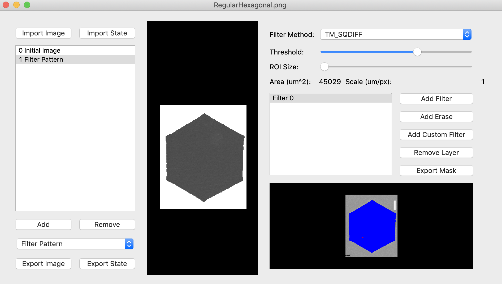

# nanoMFG Software Planning Document
<!-- Replace text below with long title of project:short-name -->
## Graphene SEM Image Analysis: GSAImage
### Target Release: 1.2.0 : July 31, 2019

## Development Team
<!-- Complete table for all team members
 roles: PI, developer, validation
 status: active, inactive
-->
Name | Role | github user | nanohub user | email | status
---|---|---|---|---|---
Elif Ertekin | PI | elifleaf | Elif Ertekin | ertekin@illinois.edu | active
Sameh Tawfick | PI | tawfick | --- | tawfick@illinois.edu | active
Joshua Schiller | developer | jaschil2 | Joshua A Schiller | jaschil2@illinois.edu | active
Kevin Liu | developer | kevindl2 | --- | kevindl2@illinois.edu | inactive
Darren Adams | developer | dadamsncsa | Darren K Adams | dadams@illinois.edu | active
Bomsaerah Seong | developer | bsrseong | --- | bseong2@illinois.edu | active
Kevin Cruse | developer | kevcruse96 | Kevin James Cruse | kevcruse96@gmail.com | active

**nanoMFG Github Team(s):** @GSA-dev

**nanoHUB Group(s):** Gr-ResQ

## 1. Introduction
<!-- A  concise description of the current iteration of work. -->
GSAImage allows users to extract relevant data from SEM images using various analysis techniques. The current iteration of the tool will include improvements in processing speed, cosmetics, and documentation on available analysis techniques. This image analysis tool will be released as a standalone tool as well as a feature of the Gr-ResQ (Graphene Recipes for the Synthesis of High Quality Materials) database suite.

### 1.1 Purpose and Vision Statement
<!--Why are we building this tool? What is the key benefit? How does it relate to existing tools and existing software? How does it fit into the overall objectives for the nanoMFG node? Who will use it?-->
SEM images are one of the primary resources for graphene synthesis analysis. GSAImage will permit users to extract information from these SEM images like graphene coverage, domain density, and domain alignment. These features will inform users and augment machine learning on the data by providing it with objective metrics to optimize. This tool will be released as a standalone research tool and as a feature of the "gresq" graphene synthesis database dashboard.

### 1.2 References
<!--List any documents or background material that are relevant.  Links are useful. For instance, a link to a wiki or readme page in the project repository, or link to a uploaded file (doc, pdf, ppt, etc.).-->
[GSAImage README page](https://github.com/nanoMFG/GSA-Image/blob/master/README.md "GSAImage README page")

## 2 Overview and Major Planned Features
<!--Provide and overview characterising this proposed release.  Describe how users will interact with each proposed feature.-->
Version 1.2.0 of GSAImage will include features related to user experience as well as improved scientific analysis of SEM images. In addition, a user manual with intuitive screenshots will be included for user instruction.  

### 2.1 Product Background and Strategic Fit
<!--Provide context for the proposed product.  Is this a completely new projects, or next version of an existing project? This can include a description of any contextual research, or the status of any existing prototype application.  If this SPD describes a component, describe its relationship to larger system. Can include diagrams.-->

This release of GSAImage represents the next version of an already published nanoHUB tool. This version of GSAImage will also be included as an analysis feature with the Gr-ResQ database tool suite. Flow for the component tools in the Gr-ResQ tool suite is shown above. The SEM image analysis tool is included as an analysis feature to study SEM images associated with various graphene recipes.

### 2.2 Scope and Limitations for Current Release
<!--List the all planned goals/features for this release.  These should be links to issues.  Add a new subsection for each release.  Equally important, document feature you explicity are not doing at this time-->

#### Release Notes v1.2.0
##### Planned Features

Feature | Description
--- | ---
[Saving/Uploading](https://github.com/nanoMFG/GSA-Image/issues/19#issue-364979479 "Saving/Uploading") | Work done during analysis can be saved and loaded within the tool environment
[Domain edge detection](https://github.com/nanoMFG/GSA-Image/issues/10#issuecomment-425507964 "Domain edge detection") | Canny edge detection and pattern filtering techniques are available for users to detect boundaries on graphene domains.
[Domain coverage](https://github.com/nanoMFG/GSA-Image/issues/13#issuecomment-425508872 "Domain coverage") | Tool will calculate area of graphene domain using reasonable scale. Functions `DrawScale` and `DomainCenters` provided to aide in area calculation
[Domain center determination](https://github.com/nanoMFG/GSA-Image/issues/15#issuecomment-425509516 "Domain center determination") | See [Domain coverage](https://github.com/nanoMFG/GSA-Image/issues/13#issuecomment-425508872 "Domain coverage") (`DomainCenters` used to maker graphene domain centers)
[Exportation of domain coverage features](https://github.com/nanoMFG/GSA-Image/issues/16#issuecomment-425509882 "Exportation of domain coverage features") | Provide "Export State" option for users to access useful data after using GSAImage
[Create user manual](https://github.com/nanoMFG/GSA-Image/issues/45 "Create user manual") | User manual will be available for tutorials and as extensive resource
[Display original image during analysis](https://github.com/nanoMFG/GSA-Image/issues/44 "Display original image during analysis") | Original image will be continually displayed for comparison while analysis manipulations and adjustments are made by user
[Provide example images](https://github.com/nanoMFG/GSA-Image/issues/39 "Provide example images") | Example images will be provided by Gr-ResQ team for novice users to test tool
[Improve "Erase" tool](https://github.com/nanoMFG/GSA-Image/issues/42 "Improve 'Erase' tool") | Erase tool will include clearly visible marker and size indicator
[Improve figure shapes in "Filter Pattern" tool](https://github.com/nanoMFG/GSA-Image/issues/43 "Improve figure shapes in 'Filter Pattern' tool") | Graphene is filtered from substrate in images using template matching. Previous release of GSAImage showed difficulty in fully covering graphene domains with template matching filter (shown in image below, parts of graphene domain are not covered by filter); Current release will include improved template matching functionality 
[Change color in "Find Contour" line](https://github.com/nanoMFG/GSA-Image/issues/46 "Change color in 'Find Contour' Lines") | Resultant shapes in "Find Contour" tool will be more clearly indicated to user using contrasting color and boldness

##### Not Done

### 2.3 Scope and Limitations for Subsequent Releases
<!--Short summary of  future envisioned roadmap for subsequent efforts.-->
Feature | Description
--- | ---
Improve template matching | Further work needs to be done to speed up custom masks for the template matching tool
Improve alignment tool | The alignment tool needs to be fleshed out a little more.

### 2.3 Operating Environment
<!--Describe the target environment.  Identify components or application that are needed.  Describe technical infrastructure need to support the application.-->
Program uses pyqt in the python environment

### 2.4 Design and Implementation Constraints
<!--This could include pre-existing code that needs to be incorporated ,a certain programming language or toolkit and software dependencies.  Describe the origin and rationale for each constraint.-->
* skimage
* opencv
* scipy
* numpy
* pyqtgraph

## 3 User Interaction and Design

### 3.1 Classes of Users
<!--Identify classes (types) of users that you anticipate will use the product.  Provide any relevant context about each class that may influence how the product is used:
The tasks the class of users will perform
Access and privilege level
Features used
Experience level
Type of interaction
Provide links to any user surveys, questionnaires, interviews, feedback or other relevant information.-->
Type | Access Level | Features Used | Experience Level | Type of Interaction
---|---|---|---|---
Community User | All | All | Novice | Used for own research
nanoMFG User | All | All | Experienced | Used for generating data for Gr-ResQ database

### 3.2 User Requirements
<!-- Provide a list of issue links to document the main set of user requirements to be satisfied by this release.  Use the user requirement template to draft thense issues.  A well written user requirement should be easy to justify (Rational) and should be testable.  List in order of priority as must have, should have or nice to have for each use case. -->

### 3.3 Proposed User Interface
<!--Could include drawn mockups, screenshots of prototypes, comparison to existing software and other descriptions.-->

Opening user interface for current release of GSAImage

GSAImage with SEM file opened

Example of analysis done on image (Filter Pattern)

## 4. Data And Quality Attributes

### 4.1 Data Dictionary
<!--Summarize inputs and outputs for the application.-->

### 4.2 Usability and Performance
<!--Summarize usability requirements such as easy of adoption for new users (eg example data),  inline documentation, avoiding errors, efficient interaction, etc.  Describe performance expectations  and/or document challenges.  Note you can reference user requirements from above if needed. -->

### 4.3 Testing, Verification and Validation
<!--Describe What data is necessary to verify the basic functionality of the application.  Provide a testing plan that includes a list of issues for each planned activity.  Describe data sets that are needed to test validation.-->

### 4.4 Uncertainty Quantification
<!--Identify and document possible sources of uncertainty. Categorize with standard labels, such as parametric, structural, algorithmic, experimental, interpolation.

Develop a plan for measuring and documenting uncertainty, e.g., using forward propagation or inverse UQ, and showing it in the application, if applicable.-->
